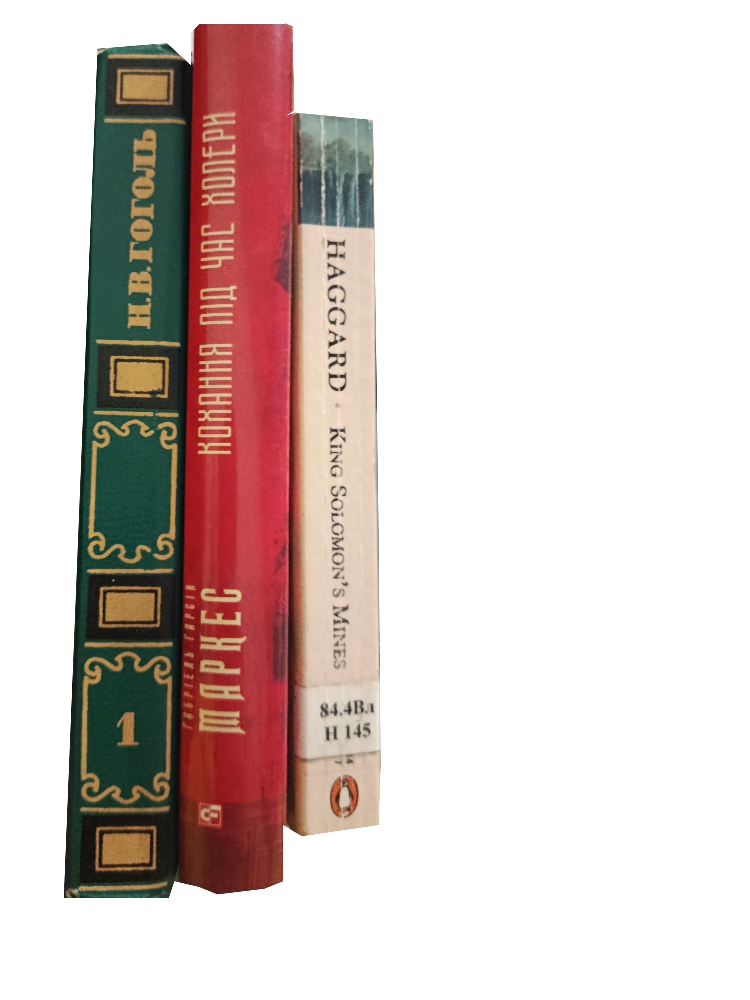

TODO:
    - make shelf look interesting
    - make books look interesting

# damn, i have no idea how to make it all(books,shelf) look good

## Ok, back to the basics: What is a book? What is a bookspine? 
# What am i tying to achive, concreatly

### hmmm, so far i gather that i can use  
    - spines **flat** or **curved**
    - spines have diffirent **colors**
    - spines have diffirent **font**
    - spines have diffirent **texture**
