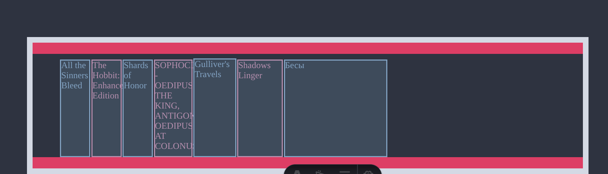
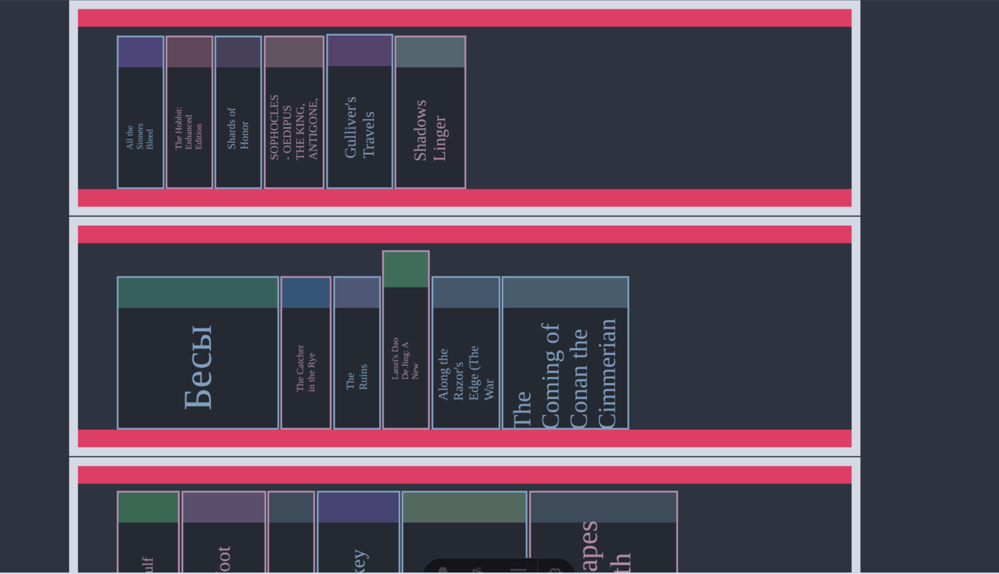
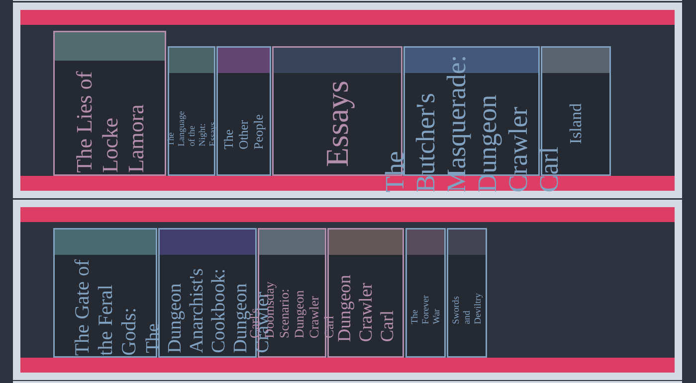

TODO:
    - make shelf look interesting
    - make books look interesting


# damn, i have no idea how to make it all(books,shelf) look good


## Ok, back to the basics: What is a book? What is a bookspine? 
# What am i tying to achive, concreatly


### hmmm, so far i gather that i can use  
    - spines **flat** or **curved**
    - spines have diffirent **colors**
    - spines have diffirent **font**
    - spines have diffirent **texture**


## IDEA_SH: 
    - i can make shelf with flex like with  topBar| BookComponent bootomBat|


16/12/2025 10:58AM

    - i can make shelf with flex like with  topBar| BookComponent bootomBat|
## IDEA_SH: is implemented successfully



## Progress so far, looks better  if you ask me 
now need to fix title size problem for books with large width
            ```
            let randomColor = "#" + ((Math.random() * 0xffffff) << 0).toString(16);
            let bookTitle = jsonBook.data.doc_title ?? "Title";
            let filterdBookTitle = jsonBook.data.doc_title
              ? jsonBook.data.doc_title.split(" ").slice(0, 6).join(" ")
              : "TITLE";
            let bookTitleFontSize =
              bookTitle.split(" ").length > 3
                ? `${book_width / 5}px`
                : `${book_width / 4}px`;
            console.log(bookTitle, bookTitleFontSize);
            ```

### styleBookFirstAttempt



styleBookFirstAttempt2
